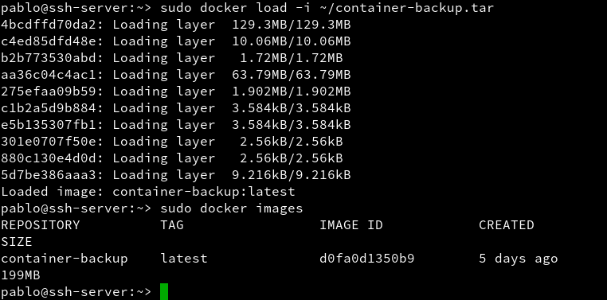
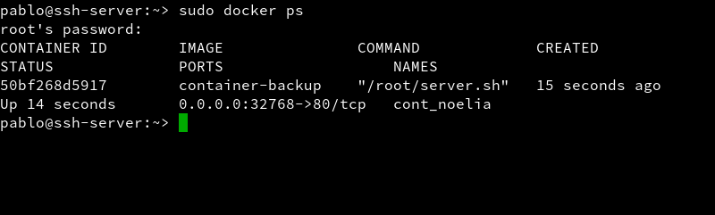

# Docker

## 1.- Instalamos Docker  

> `zypper in docker`  

    Lo iniciamos con el comando  `systemctl start docker`   

> Miramos que version de docker tenemos instalada   y añadimos permisos a nuestro usuario  

*  Ahora salimos de la sesion y entramos con nuestro usuario y ejecutamos lo siguientes comandos:

> `docker images` sirve para ver las imagenes descargadas hasta ahora  

  
> `docker ps -a` enseña los contenedores creados

   

>Ahora hacemos `docker run hello-world` para descargar y ejecutar el contenedor "hello-world"

>Ahora ejecutamos  `docker images` y podemos ver a "hello-world"

>y yambien podemos ver su contenedor si ejecutamos `docker ps -a`  

## 2.- Configuración de la red
* Si queremos que nuestro contenedor tenga acceso a la red exterior, debemos activar la opción IP_FORWARD (net.ipv4.ip_forward). Lo podemos hacer en YAST.

>  Yast -> Dispositivos de red -> Encaminamiento -> Habilitar reenvío IPv4

> y la otra forma es ir a esta ruta y `/etc/sysconfig/SuSEfirewall2` y poner `FW_ROUTE="yes"`.

## 3.- Creamos una imagen manualmente  
>  Vemos las imágenes disponibles localmente

>Buscamos en los repositorios de Docker Hub

>Descargamos una imagen `debian:8` en local

> Vemos todos los contenedores

> Vemos sólo los contenedores en ejecución

* Vamos a crear un contenedor con nombre `cont_debian` a partir de la imagen debian:8, y ejecutaremos `/bin/bash`:

>Comprobamos que estamos en Debian

>Instalamos nginx en el contenedor

> Instalamos el nano en el contenedor

> iniciamos nginx

* Creamos un fichero holamundo.html
> echo `
Hola nombre-del-alumno
` `/var/www/html/holamundo.html`

* y creamos un script llamado server.sh  en la ruta `/root/server.sh`

* Ya tenemos nuestro contenedor auto-suficiente de Nginx, ahora debemos crear una nueva imagen con los cambios que hemos hecho, para esto abrimos otra ventana de terminal y busquemos el IDContenedor:

  

* Ahora con esto podemos crear la nueva imagen a partir de los cambios que realizamos sobre la imagen base:

* Ahora paramos el contenedor y lo eliminamos

  

## 4.- Creamos contenedor con nginx

> creamos el contenedor

> Comprobamos y miramos el puerto que usa en este caso es el `32771`

> abrimos el navegador y ponemos `localhost:32771` y nos saldra la pagina principal de Nginx

* Ahora paramos el contenedor y lo eliminamos

## 4 .- Crear un contenedor Dockerfile  

> Creamos el fichero dockerfile con el siguiente contenido:

  
> Construye imagen a partir del Dockefile

> Ahora creamos un contendor con el nombre cont_nginx2 paara que ejecute el siguiente programa

> Luego vamos al navegador y ponemos `localhost:32771/holamundo.html` y nos saldra nuestra pagina funcionando con nginx

## 5 .- Migrar imagenes de docker a otro servidor  

>Grabo una imagen con el nombre container-backup

* Ahora cojere la imagen de una compañera para probar la migración

> cargamos la imagen docker a partir del fichero tar.

> ejecutamos la imagen 

> y vemos que funciona correctamente

