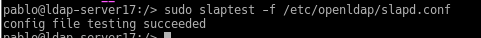

# Servidor LDAP Open Suse

## Paso 1-. Servidor LDAP

 * Preparamos la maquina
 >*  Nombre equipo: ldap-serverXX:
  * Además en /etc/hosts añadiremos:

## Paso 2 -. Instalamos el servidor LDAP:

* Para eso tenemos que instalar el modulo yast que sirve para gestionar LDAP
>yast2-auth-server

*  vamos a yast y ponemos "Servidor de autentificacion"y ponemos la siguiente configuracion:

* No habilitamos kerberos

* Hacemos comprobaciones:  

  

  

  

* Comprobar que tenemos creadas las unidades organizativas: groups y people.

    

## PASO 3-.  Crear Usuarios y grupos LDAP    

* Yast -> Usuarios Grupos -> Filtro -> LDAP  

* Crear el grupo piratas2 (Estos se crearán dentro de la ou=groups).
* Crear los usuarios pirata21, pirata22 (Estos se crearán dentro de la ou=people)  

  

  

* Usar gq para consultar/comprobar el contenido de la base de datos LDAP.   

  

  > * ldapsearch -x -L -u -t "(uid=nombre-del-usuario)", comando para consultar en la base de datos LDAP la información del usuario con uid concreto.  

    

 ## PASO 4 -.Cliente LDAP

* Vamos a otra MV OpenSUSE.  

* Cliente LDAP con OpenSUSE:
    *  Configuración MV
    *  Nombre equipo: ldap-clientXX
    *  Dominio: curso1718  

*  Asegurarse que tenemos definido en el fichero /etc/hosts del cliente, el nombre DNS con su IP correspondiente:  

  

* Comprobacion:    

* nmap -Pn ldap-serverXX | grep -P '389|636', para comprobar que el servidor LDAP es accesible desde el cliente.  

   

* Usar gq en el cliente para comprobar que se han creado bien los usuarios.

    * File -> Preferencias -> Servidor -> Nuevo
    * URI = ldap://ldap-server17
    * Base DN = dc=viera17,dc=curso1718

   

* Instalamos cliente LDAP
> Ir a Yast -> LDAP y cliente Kerberos  

   

   

* Comprobamos desde el cliente:  
  * getent passwd pirata21:  

  

  * getent group piratas2  

  * id pirata21    

  * finger pirata21

  

  * cat /etc/passwd | grep pirata21  

  No aparece nada , porque no tiene que estar estos usuarios en este equipo

  * cat /etc/group | grep piratas2  

  No aparece nada , porque no tiene que estar estos usuarios en este equipo

  * su pirata21    

