# *Samba con  Open Suse y windows 7*
## PASO 1-.Creamos el servidor samba en open suse
>Configuramos la maquina de manera que se llame  smb-server17  

* En "/etc/host" ponemos los equipos de los clientes que se llamaran smb-cli17a y smb-cli17b

* ahora ponemos los siguientes comandos de comprobacion:
       hostname -f
       ip a
       lsblk
       sudo blkid  

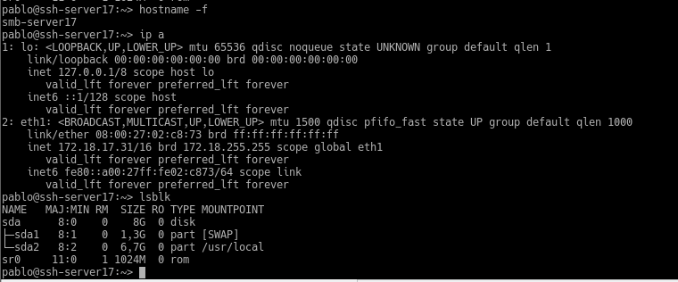  

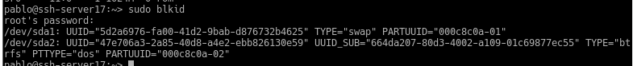    

## PASO 2-.Creamos los usuarios locales

* Primero Creamos el usuario smbguest. Para asegurarnos que nadie puede usar smbguest para entrar en nuestra máquina mediante login, vamos a modificar este usuario y le ponemos como shell /bin/false.  

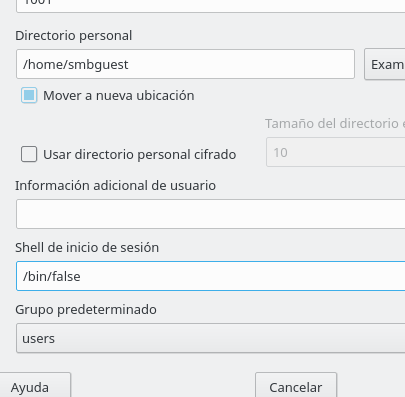   

* Luego  creamos el grupo pirata e incluimos a los usuarios pirata1, pirata2 y supersamba   , el grupo soldados y metemos a los usuarios soldado1 y soldado2 y supersamba ,
el grupo todos y dentro todos los usuarios soldados, pitatas, supersamba y a smbguest y Poner a los usuarios de samba dentro del grupo cdrom  

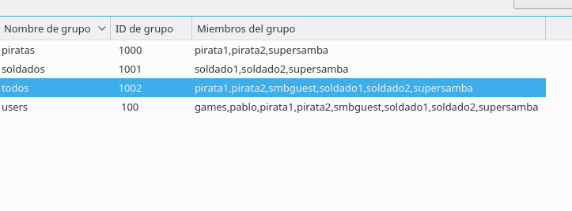

## PASO 3-.Creamos las carpetas de los futuros recursos compartidos  
* Vamos a crear las carpetas de los recursos compartidos con los permisos siguientes:
  > * /srv/sambaXX/public.d
    Usuario propietario supersamba.
Grupo propietario todos.
Poner permisos 775.
  * /srv/sambaXX/castillo.d
Usuario propietario supersamba.
Grupo propietario soldados.
Poner permisos 770.
  * /srv/sambaXX/barco.d
Usuario propietario supersamba.
Grupo propietario piratas.
Poner permisos 770.  

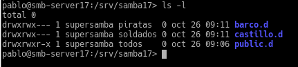  

## Paso 4-.Configurar el servidor samba

* Vamos a hacer una copia de seguridad del fichero de configuración existente cp /etc/samba/smb.conf /etc/samba/smb.conf.000.  

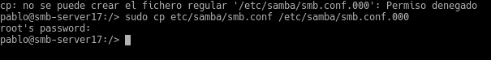  

*  Yast -> Samba Server ponemos en
Workgroup: mar1718 y
Sin controlador de dominio.    

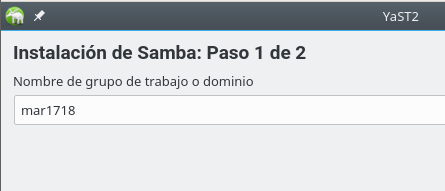  
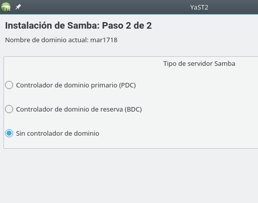   

*En la pestaña de Inicio definimos
Iniciar el servicio durante el arranque de la máquina.
Ajustes del cortafuegos -> Abrir puertos  

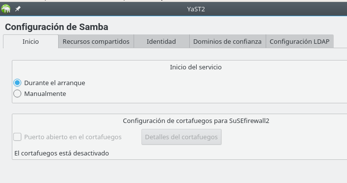   

## PASO 5-. creamos los recursos compartidos de Samba

* Vamos a configurar los recursos compartido del servidor Samba. Podemos hacerlo modificando el fichero de configuración o por entorno gráfico con Yast y establecemos la siguiente configuracion:   

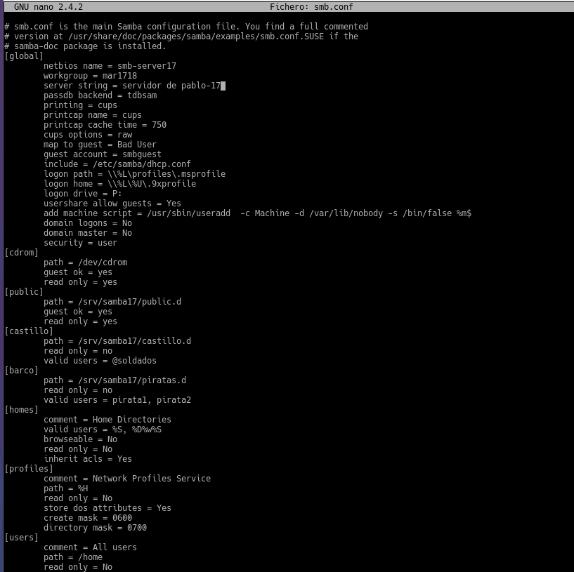     

* Luego Abrimos una consola para comprobar los resultados.  

     cat /etc/samba/smb.conf
     testparm  

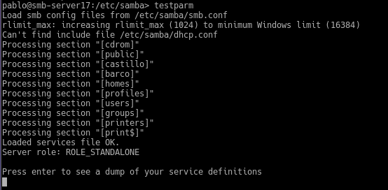      

## PASO 5-.Añadimos los usuarios del sistema al Samba  
* smbpasswd -a nombreusuario, para crear clave de Samba para un usuario del sistema.   

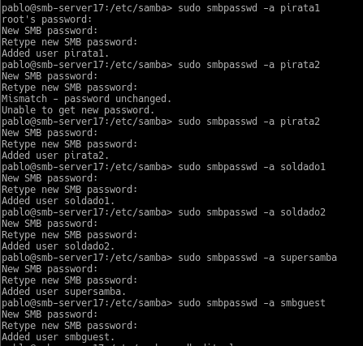     

* pdbedit -L, para comprobar la lista de usuarios Samba.    

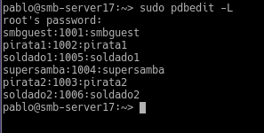    

## PASO 6-. Reiniciamos el samba  para que se cojan los cambios que hemos hecho

>  Podemos hacerlo por Yast -> Servicios, o usar los comandos.:
* Servicio smb
 * systemctl stop smb
 * systemctl start smb
 * systemctl status smb  
* Servicio nmb
 * systemctl stop nmb
 * systemctl start nmb
 * systemctl status nmb

  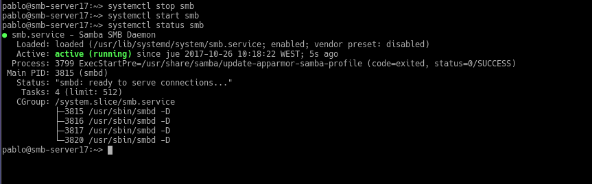  

     

* ahora ponemos los siguientes comandos   

      sudo testparm  (para ver si la sintaxis del fichero de configuracion del samba esta bien)

      sudo netstat -tap  (para ver si el servicio smb esta escuchando)   

  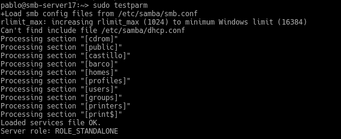    

  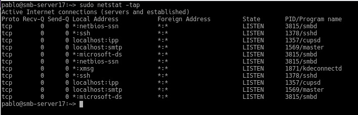   

  ## PASO 7-. Ahora en Windows  
* ya habiendo configurado el windows Escribimos \\ip-del-servidor-samba y vemos lo siguiente:  

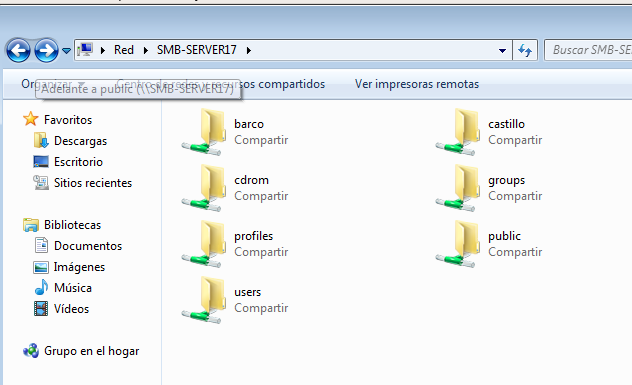   

* Comprobamos los accesos de todas las formas posibles. Como si fuéramos:
un soldado,
un pirata,
y/o un invitado.   

  

> si entramos en pirata nos da acceso denegado    

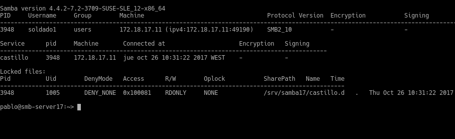  

* Capturar imagen de los siguientes comandos para comprobar los resultados:  
>  * smbstatus, desde el servidor Samba.  
   * netstat -ntap, desde el servidor Samba.  
   * netstat -n, desde el cliente Windows.  

   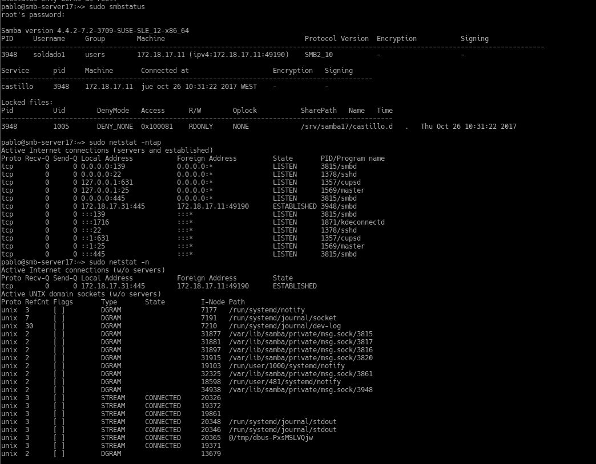     

 ## PASO 8-.Comandos en windows:
 * En el cliente Windows, para consultar todas las conexiones/recursos conectados hacemos C:>net use.

 * Si hubiera alguna conexión abierta la cerramos.
   *  net use * /d /y, para cerrar las conexiones SMB.
   * net use ahora vemos que NO hay conexiones establecidas.    

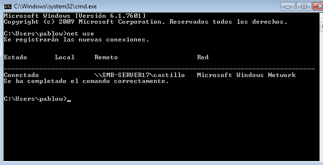    

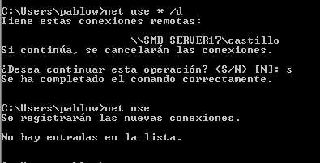      

* Con el comando net view, vemos las máquinas (con recursos CIFS) accesibles por la red.

* El comando net use S: \\ip-servidor-samba\recurso clave /USER:usuario /p:yes establece una conexión con el recurso compartido y lo monta en la unidad S. Probemos a montar el recurso barco  
y con net use lo Comprobamos

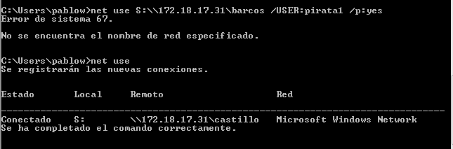    

* Ahora podemos entrar en la unidad S ("s:") y crear carpetas, etc.

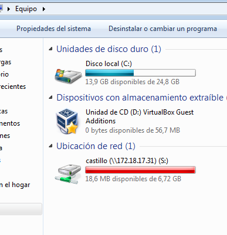   

* ahora hacemos unos comandos de comprobacion:  
  * smbstatus, desde el servidor Samba

  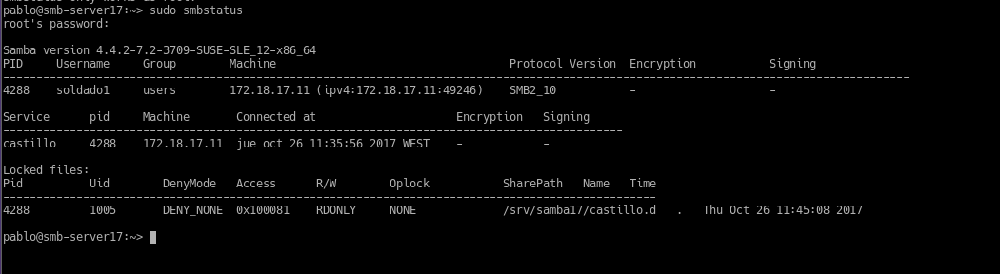

  * netstat -ntap, desde el servidor Samba.

  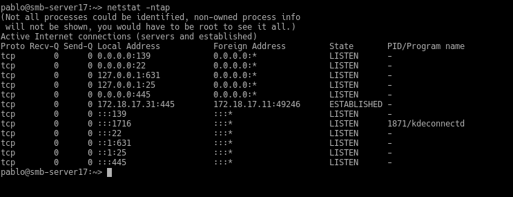

  * netstat -n, desde el cliente Windows.

  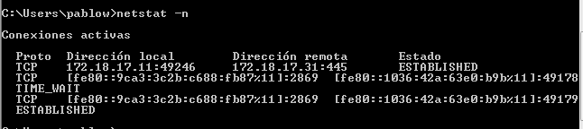   

## PASO 9 -. Cliente GNU/Linux GUI   

* accedemos al las carpetas compartidas desde el cliente   

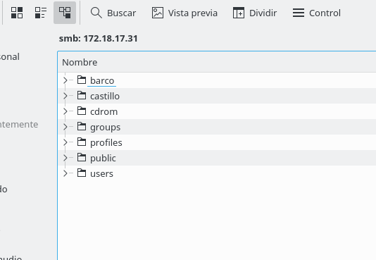

* Probamos a crear carpetas/archivos en castillo y en barco.  

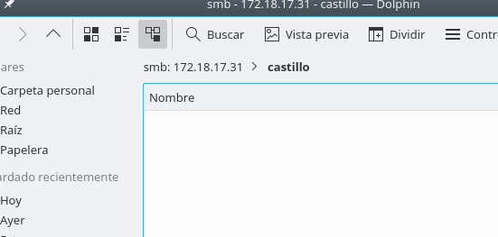   

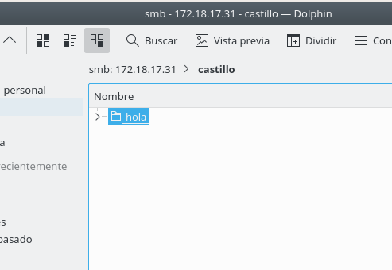
* Comprobamos que el recurso public es de sólo lectura.  

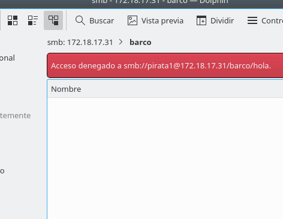   

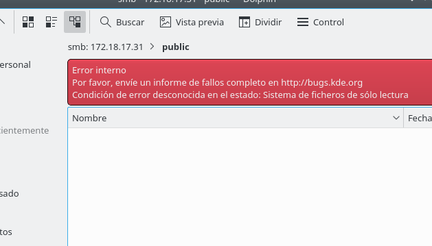
* ponemos siguientes comandos para comprobar los resultados:
  * smbstatus, desde el servidor Samba.
  * netstat -ntap, desde el servidor Samba.
  * netstat -ntap, desde el cliente Linux.  

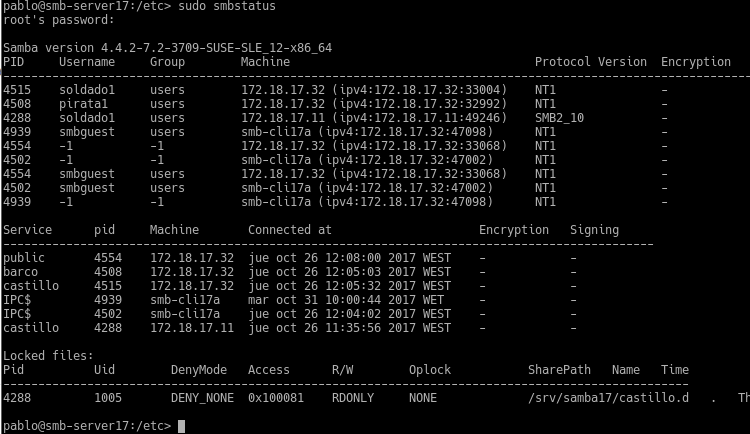  

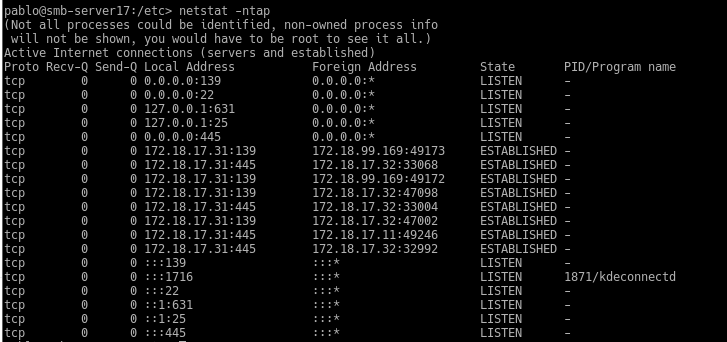  

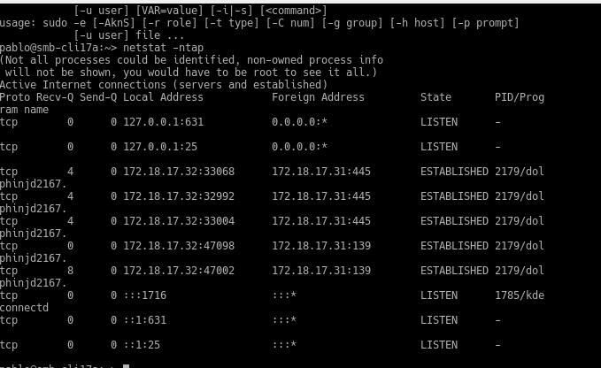    

## PASO 10 -.Cliente linux comandos:  

* Primero comprobar el uso de las siguientes herramientas:
 >* sudo smbtree   
    * Muestra todos los equipos/recursos de la red SMB/CIFS
    * Hay que abrir el cortafuegos para que funcione, o bien
    *   ejecutarlo desde la máquina real.

 >* smbclient --list ip-servidor-samba
    * Muestra los recursos SMB/CIFS de un equipo concreto    

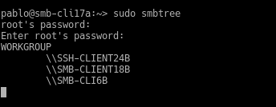  

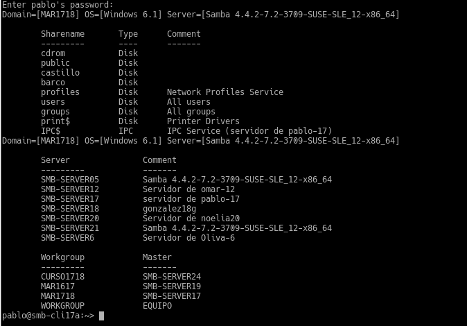   

* Ahora crearemos en local la carpeta /mnt/sambaXX-remoto/castillo.

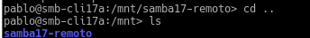    

*  Con el usuario root, usamos el siguiente comando para montar un recurso compartido de Samba Server, como si fuera una carpeta más de nuestro sistema: mount -t cifs //172.18.XX.55/castillo /mnt/sambaXX-remoto/castillo -o   username=soldado1

     

* y comprobamos   
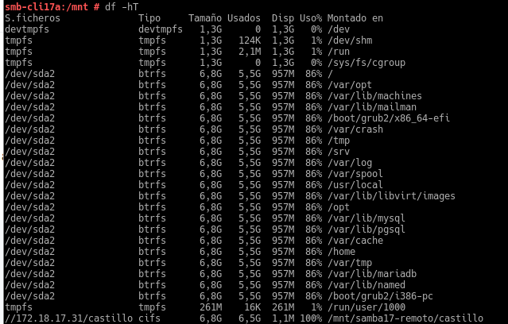   

* Capturar imagen de los siguientes comandos para comprobar los resultados:
  * smbstatus, desde el servidor Samba.
  * netstat -ntap, desde el servidor Samba.
  * netstat -ntap, desde el cliente Linux.  

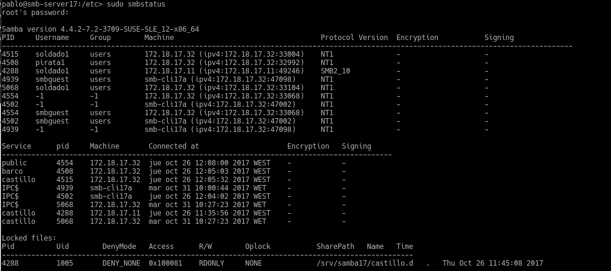   

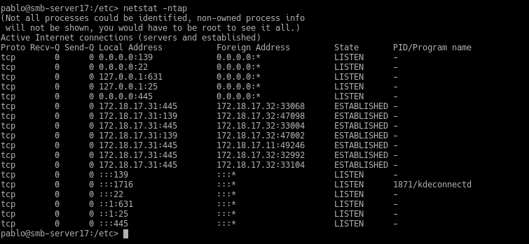  

## PASO 11 -. Montaje automatico  

* Para configurar acciones de montaje automáticos cada vez que se inicie el equipo, debemos configurar el fichero /etc/fstab
         //smb-serverXX/public /mnt/remotoXX/public cifs username=soldado1,password=clave 0 0    

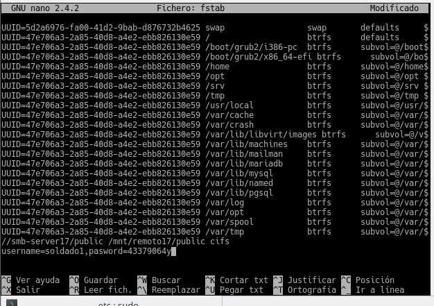    

* Reiniciar el equipo y comprobar que se realiza el montaje automático al inicio.  

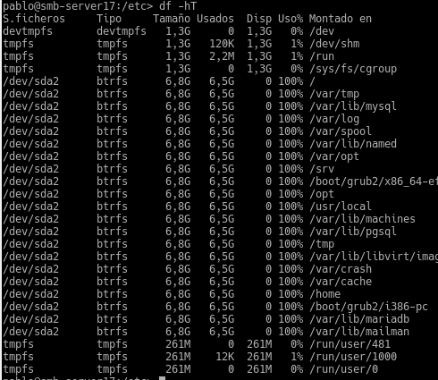   

## PREGUNTAS:  

* ¿Las claves de los usuarios en GNU/Linux deben ser las mismas que las que usa Samba?  

no , porque son otros usuarios

* ¿Puedo definir un usuario en Samba llamado soldado3, y que no exista como usuario del sistema?    

si , porque es otro tipo de usuario  

* ¿Cómo podemos hacer que los usuarios soldado1 y soldado2 no puedan acceder al sistema pero sí al samba? (Consultar /etc/passwd)    

dejandolos como usuarios de samba y quitandolos del sistema

* Añadir el recurso [homes] al fichero smb.conf según los apuntes. ¿Qué efecto tiene?  

nos permitira compartir la carpeta home de cada usuarios
