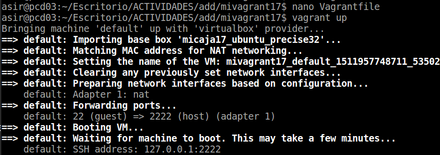
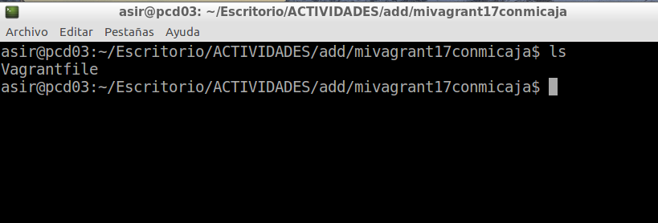

# Vagrant

## 2. Primeros pasos

### 2.1 Instalamos vagrant:
>Vagrant version

> VboxManage -v

### 2.2 Proyecto:
**Creamos un directorio para nuestro vagrant llamado vagrant17 en nuestro caso**
>  Dentro de la carpeta ejecutamos Vagrant init

### 2.3 Imagen, caja o box
>* primero hacemos un vdir para ver si se ha creado el fichero vagrantfile,
* despues ejecutamos: "vagrant box add micajaXX_ubuntu_precise32 http://files.vagrantup.com/precise32.box"

**Luego ejecutamos "vagrant box list" para ver las imagenes o cajas disponibles**

**Ahora nos metemos en el fichero vagrantfile y configuramos el fichero de la siguiente forma:**

### 2.4 Iniciamos una nueva maquina
**Nos metemos en la carpeta vargarnt 17 y ejecutamos "vagrant up" para que se inicie la maquina**

**Ahora nos conectamos por SSH a la maquina vagrant**

### 3. configuramos el entorno virtual  

**con "ls/vagrant" podemos ver que aparece el archivo vagrantfile que esta siendo compartido desde la maquina real**

> Instalamos el apache2

> Ahora modificamos el fichero vagrantfile de la siguiente manera  de modo que el puerto 4567 del sistema anfitrión sea enrutado al puerto 80 del ambiente virtualizado.  

>y recargamos el vagrant con reload:  

* Ahora hacemos los siguientes comandos de comprobacion :  

> nmap -p 4500-4600
(debe estar abierto el puerto 4567)

   

> netstat -ntap, debe mostrar tcp 0.0.0.0:4567 0.0.0.0:* ESCUCHAR.

> y cuando vamos e el navegador a  http://127.0.0.1:4567   nos funciona porque estamos accediendo al servicio virtualizado en el puerto 80  

### 4 Suministro  

**Creamos el script install_apache.sh**  

**Ahora vamos al fichero vagrantfile y ponemos esta linea dentro del fichero**

>config.vm.provision :shell, :path => "install_apache.sh"

> recargamos la maquina con reload para que se actualizen los cambios :  

  

> y lo volvemos a ejecutar con vagrant provision

  

**Para verificar que efectivamente el servidor Apache ha sido instalado e iniciado, abrimos navegador en la máquina real con URL http://127.0.0.1:4567.**

### 4.1 Suministro mediante puppet  

**vamos a crear un  entorno de desarrollo vagrant y puppet :**

> Modificar el archivo el archivo Vagrantfile de la siguiente forma:

> Crear un fichero manifests/default.pp, con las órdenes/instrucciones puppet para instalar el programa nmap. Ejemplo:  

  

> y hacemos reload para que se cojan los cambios:  

   

> y lo volvemos a ejecutar con vagrant provision

   

### 5.Nuestra caja personalizada  

> * Crear una MV VirtualBox nueva o usar una que ya tengamos
pd: Tenerla con el guet aditios instalado

> * Instalar OpenSSH Server en la MV.  

**Instalamos OpenSHH**  

   

**Creamos el usuario vagrant**  

**Le ponemos una contraseña**

>Contraseña :vagrant  

**Creamos el fichero .ssh**

  

**Le ponemos una clave publica al fichero**

  

**Le damos permisos**  

**Vamos a etc/sudoers y añadimos la siguiente liena para que no nos solicite la contraseña del root cuando hagamos operaciones con el usuario vagrant**

>Añadir vagrant ALL=(ALL) NOPASSWD: ALL a /etc/sudoers.

  

**Miramos la version de Nuestra VirtualBox para asegurarnos de que tengamos una version compatible**  

### 5.1.Creamos la caja vagrant  

**Vamos a crear una nueva carpeta mivagrant17conmicaja**

**Ejecutamos Vagrant init para crear el fichero vagrantfile**

  

**y dentro ponemos esto:**  

**Creamos package.box a partir de la MV**  

**Comprobamos que se ha creado la caja package.box**

**Añadimos la caja creada a nuestro repositorio de vagrant**  

**Y mostramos la lista de maquinas disponibles**  

   

   

**Y ya podemos acceder por SSH a nuestra maquina**  

   
