# Cientes ligeros #

## SERVIDOR LTSP

**1 Preparando la maquina**  

 Primero creamos la maquina servidor con dos interfaces de red una externa y otra interna.

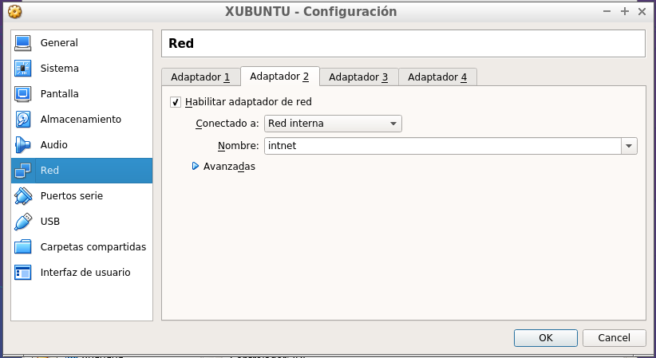  

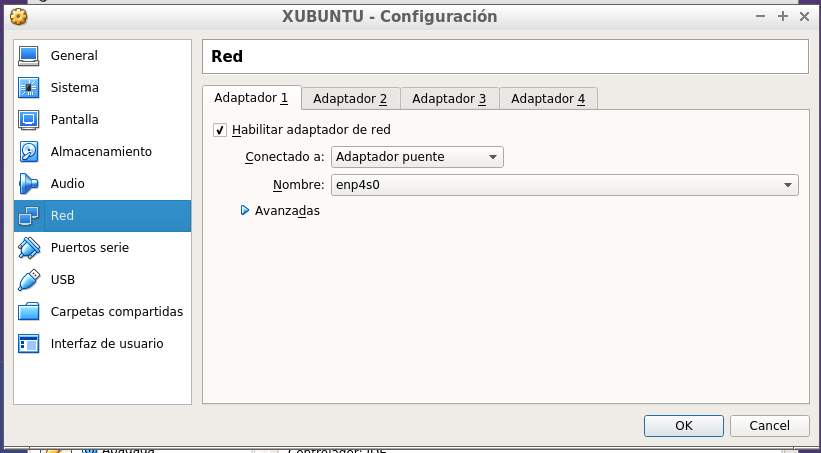

la de red externa la ponermos en modo adaptador puente y la segunda es la que debe conectarse al cliente ,esta debe ser estatica y estar en la misma red que el cliente

  **2/Instalacion de SSOO**  
  instalamos xubuntu  
  y ponermos los siguientes comandos  
  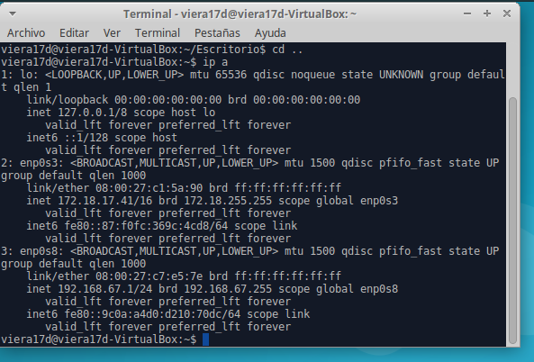   

  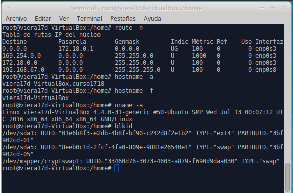

  tambien creamos 3 usuarios locales  llamados: primer-apellido-alumno1, primer-apellido-alumno2, primer-apellido-alumno3.  

  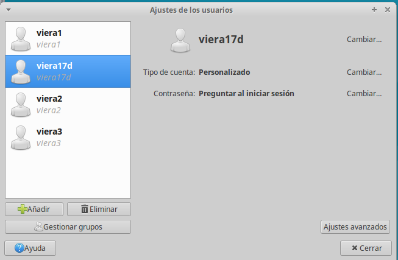

  **3/instalar el servicio LTSP**  
  Instalar el servidor SSH apt-get install openssh-server, para permitir acceso remoto a la máquina.  

  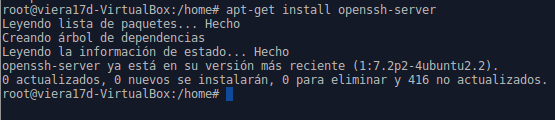

  Modificamos SSH con PermitRootLogin Yes.    

  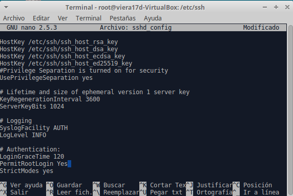  

 instalamos el servidor del cliente ligero    

  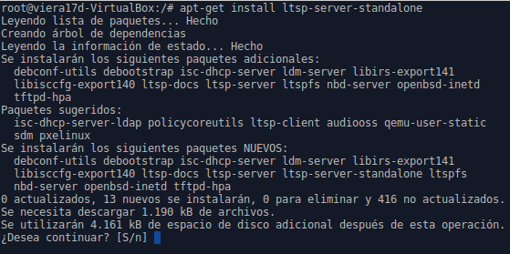    

  Ahora vamos a crear un imagen del SO a partir del sistema real haciendo ltsp-build-client

  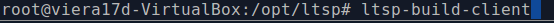     

  y la imagen creada  

  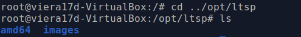

antes consultamos informacion con ltsp-info  
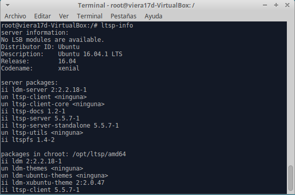

Finalmente Modificamos el fichero de configuracion /etc/ltsp/dhcpd.conf
y cambiamos todo lo que pone "1386" por "amd64"  
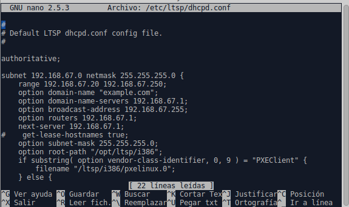

En el fichero /etc/ltsp/dhcpd.conf modificar el valor range 192.168.67.1XX 192.168.67.2XX;. Donde XX es el número de puesto de cada alumno.  

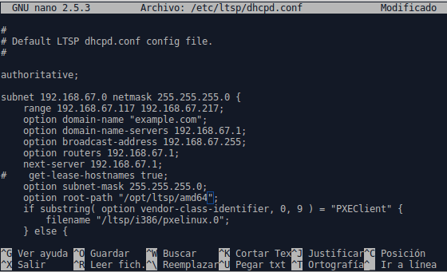    

Reiniciamos el servidor, y comprobamos que los servicios están corriendo  

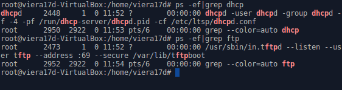     

**4/ Preparar Cliente**

  *Sin disco duro y sin unidad de DVD.

  *Sólo tiene RAM, floppy

  *Tarjeta de red PXE en modo "red interna".*

  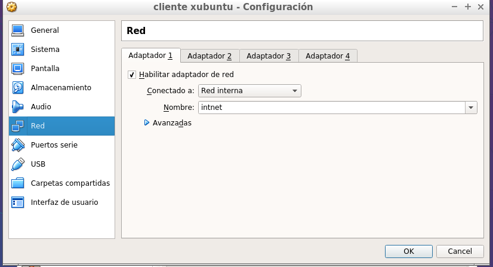  

  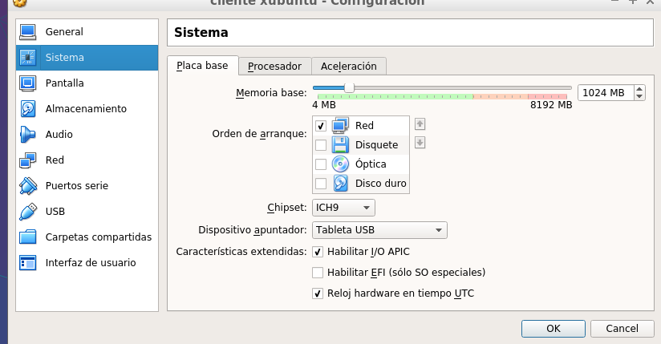  

Con el servidor encendido, iniciar la MV cliente desde red/PXE:

  Comprobar que todo funciona correctamente.  
  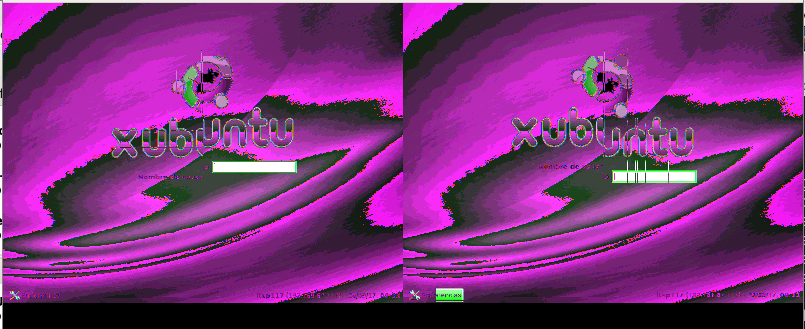    

tenemos el cliente de 64 y no se nos puedo arreglar el fallo de la doble pantalla
