## Conexiones remotas con VNC

* ####  Paso 1/ conexiones remotas
  * Tenemos que tener dos maquinas de windows con vnc que sean cliente y servidor

    * ips de maquinas de windows:

servidor:  

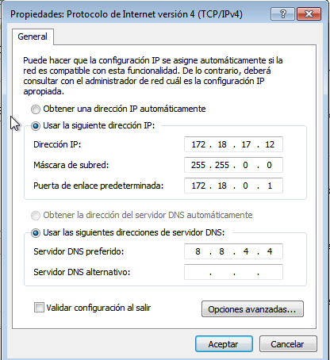  

cliente:   

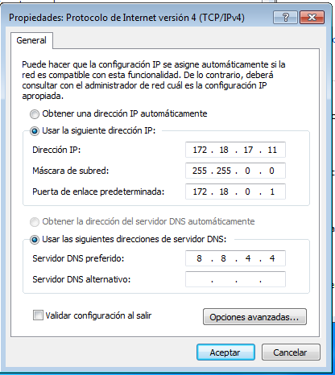

  * Dos maquinas de open suse con vnc tanto cliente como servidor

       * ips maquinas open suse :    

servidor:     
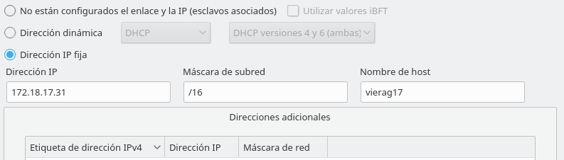  

cliente:
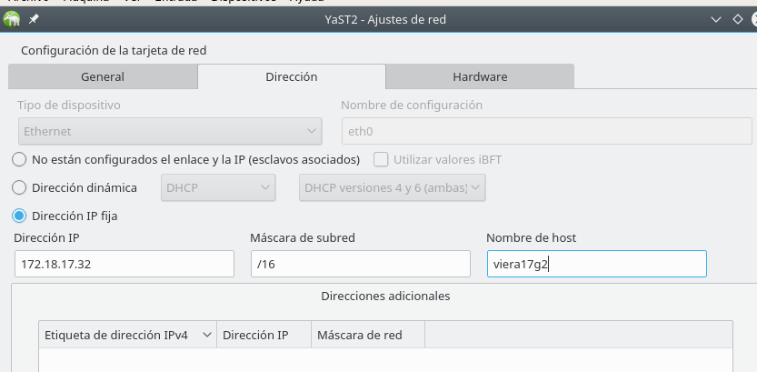  

* ####  Paso 2/ descargamos Tight VNC en las maquinas de windows

  * instalamos el vnc tanto en el servidor como el cliente  

        en el ponemos abrimos el vnc , ponemos la  ip y le damos a connect

      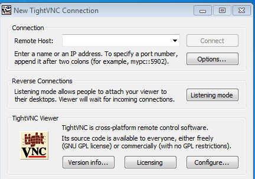   
  * ponemos la ip y nos saldra una contraseña , la ponemos y ya nos podremos conectar  

           

 * y ya nos podremos conectar    

  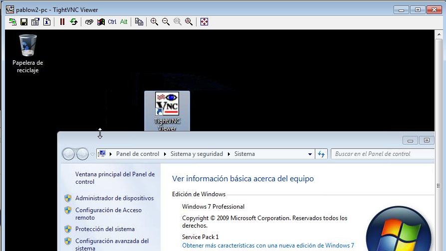   

      por ultimo ponemos el comando de comprobacion "nestat -n" para comrpobar
      que se ha conectado correctamente

  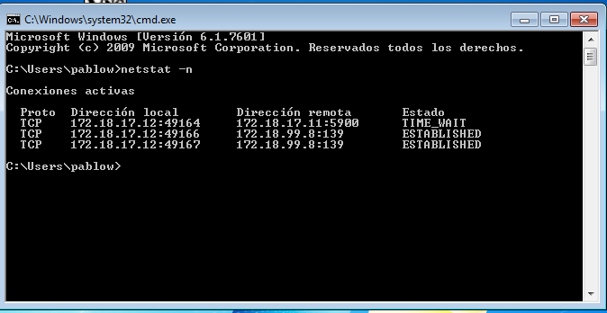         

* #### Paso 3/  instalamos y conectamos opensuse server con cliente

 * Vamos a yast ponemos "vnc" y configuramos cliente y servidor de la siguiente manera  

 cliente:   

   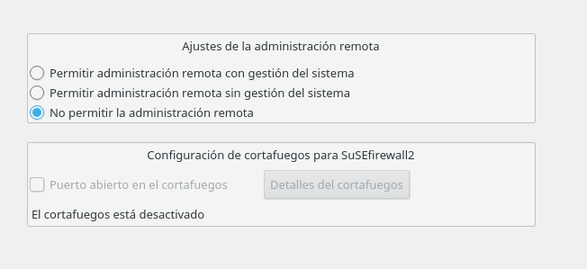  

 servidor:  
 
   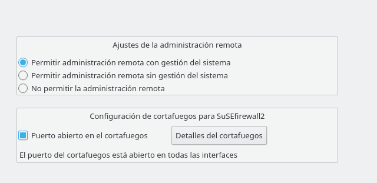   

       ahora si queremos poner una contraseña para las conecciones remotas
       tenemos que poner en el terminal "vncserver" y ya podremos cambiarla  

  * Para conectarnos ponemos "vncviewer" metemos la ip junto al puerto

    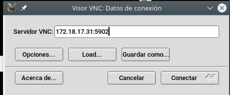  

  * Y ya estaria conectado  

    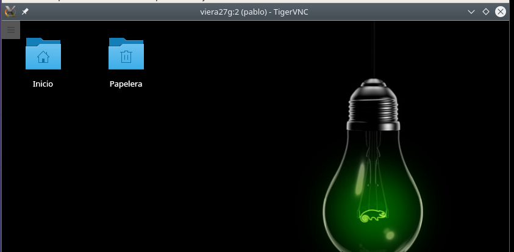      

         ahora ponemos el comando ps -ef|grep vnc para comprobar que las conecciones han funcionado  

      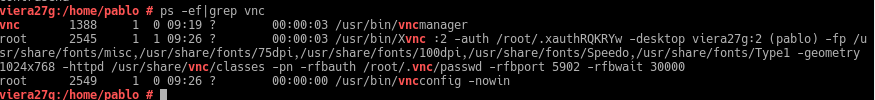     

* ##### Paso 4/ conectamos maquina windows con open suse y viceversa    

  * Windows en open suse:  
    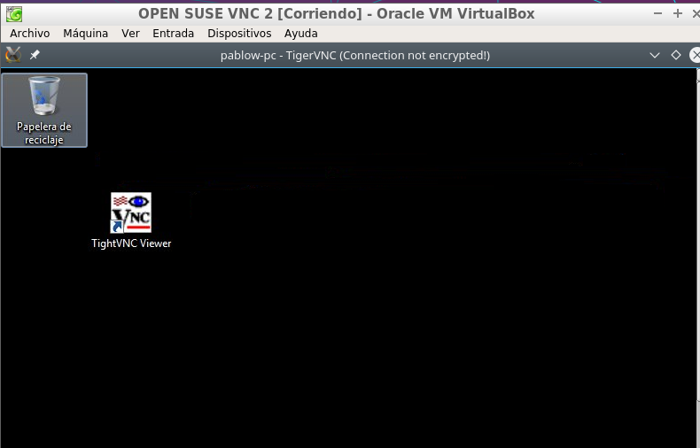   

  * Open suse en windows:
      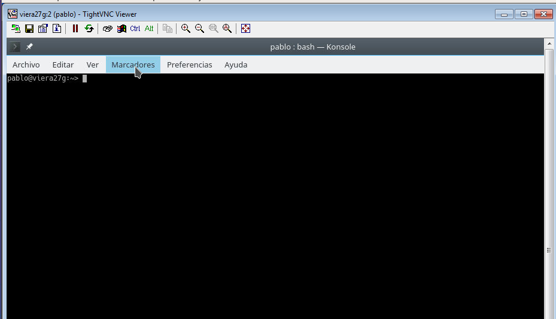
