# Servidor de Impresión en Windows
>Necesitamos:
* 1 Windows Server
* 1 Windows Cliente

## PASO 1-.Impresora compartida:
* ### Rol de impresion

       Instalar rol/función de servidor de impresión en el servidor.
        Incluir impresión por Internet.

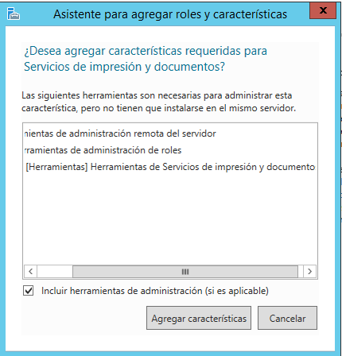

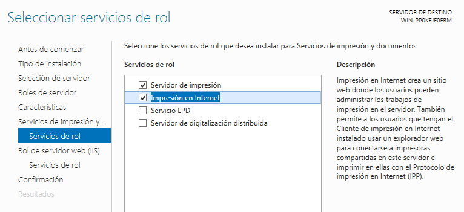

* ### Instalar impresora PDF
>*  Instalamos PDF Creator
 *  En PDFCreator, configurar en perfiles -> Guardar -> Automático. Ahí configuramos carpeta destino.

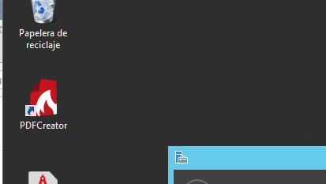

* **Ponemos la ruta donde se guardaran los archivos que imprimiremos**

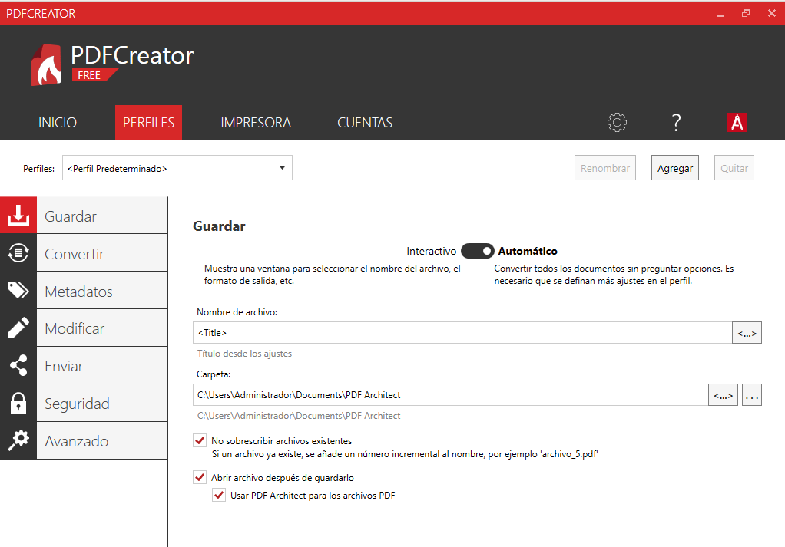

* ### Probamos la impresora local
 >Probamos la nueva impresora abriendo el Bloc de notas y creando un fichero luego selecciona imprimir. Cuando finalice el proceso se abrirá un fichero PDF con el resultado de la impresión.

 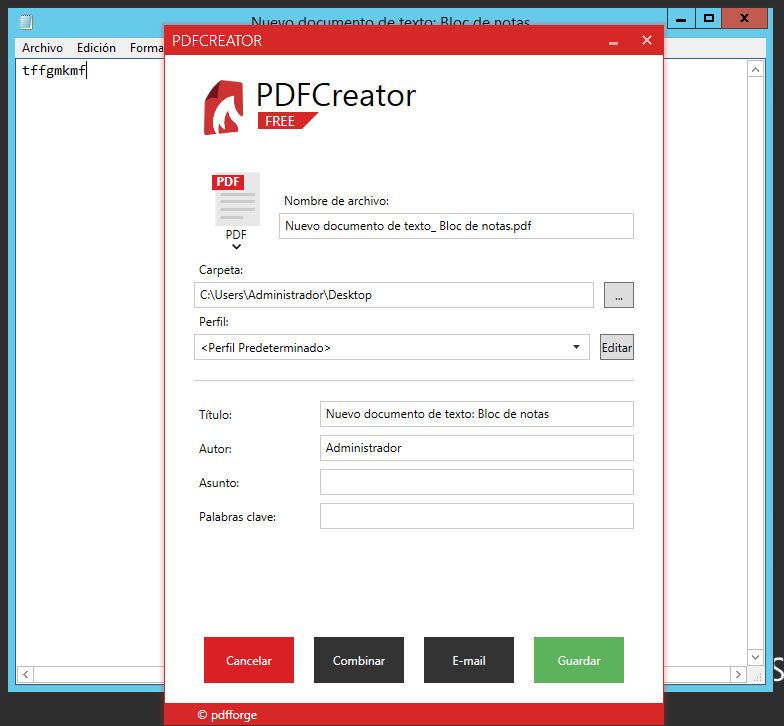

 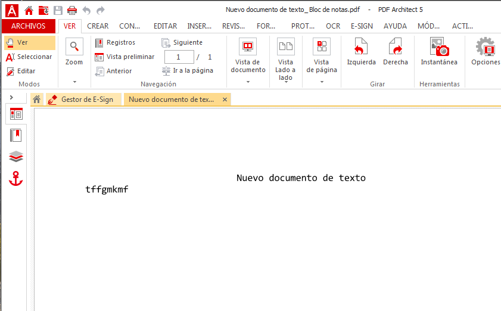

* ### Compartir por red  
>Vamos al servidor:
  * Botón derecho -> Propiedades -> Compartir
    Como nombre del recurso compartido utilizar PDFnombrealumnoXX

    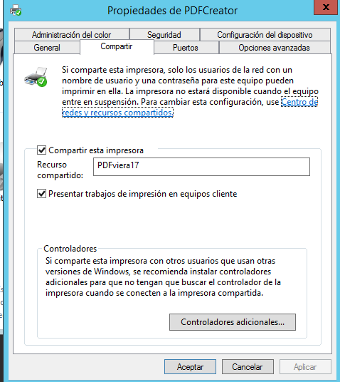  

* **luego en el cliente vamos a dispositivos e impresoras , ponemos la ip del servidor arriba y asgnamos la impresora del server**

    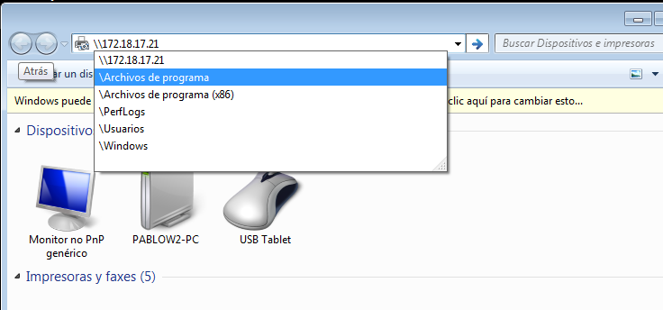

    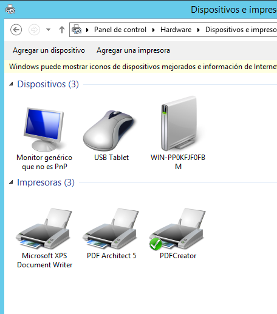

## PASO 2 -. Acceso Web :   

>* Vamos al servidor.
* Nos aseguramos de tener instalado el servicio "Impresión de Internet"  

* **Configuramos impresion web :**  
>  * Vamos al cliente.
  * Abrimos un navegador Web.
  * Ponemos URL http://<ip-del-servidor>/printers (o http://<nombre-del-servidor>/printers) para que aparezca en nuestro navegador un entorno que permite gestionar las impresoras de dicho equipo

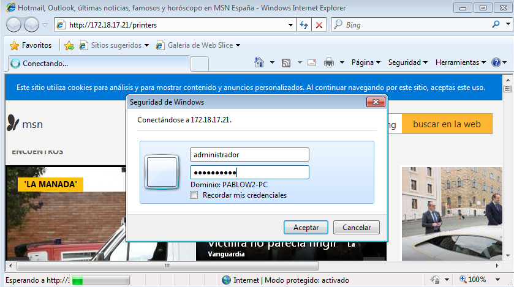  

  

* **Agregamos la impresora en el cliente utilizando la URL, como se muestra en la siguiente pantalla:**  

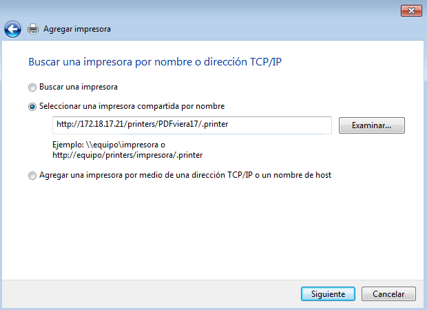

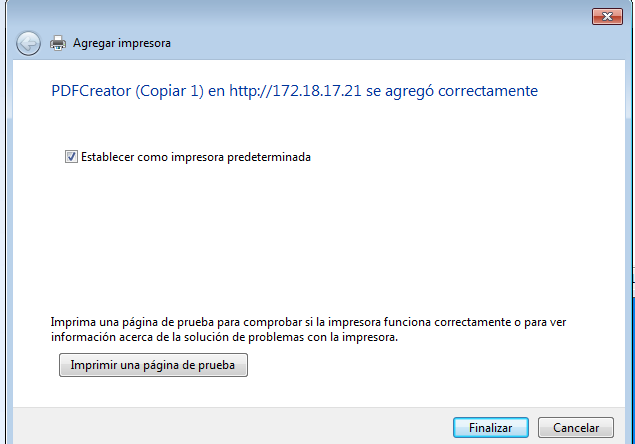
## PASO 3 .-    

>* A través del navegador pausa todos los trabajos en la impresora.
*  Envía a imprimir en tu impresora compartida un documento del Bloc de notas. La siguiente pantalla muestra que la impresora esta en pausa y con el trabajo en cola de impresión.  

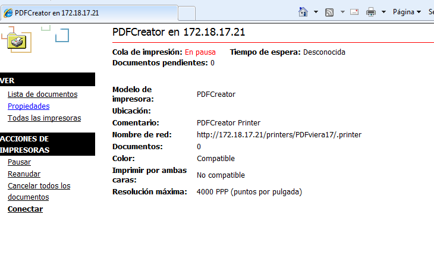  

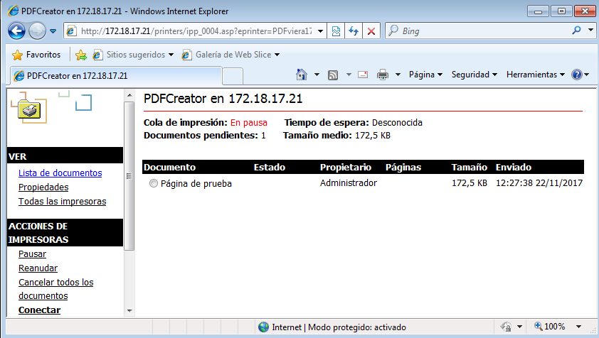  

> Finalmente pulsa en reanudar el trabajo para que tu documento se convierta a PDF. Comprobar que se puede imprimir desde un cliente Windows.  

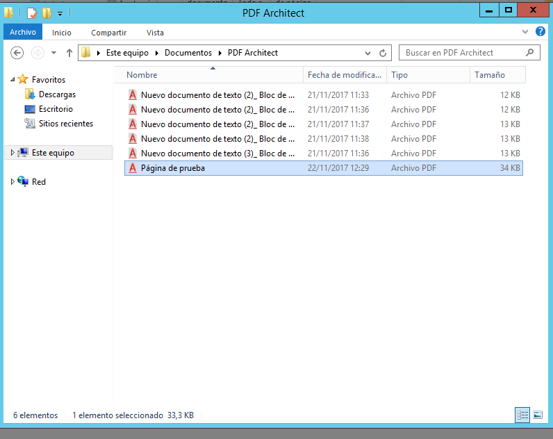  

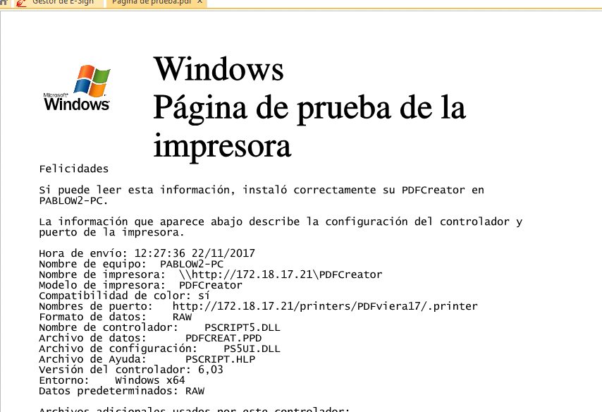  
