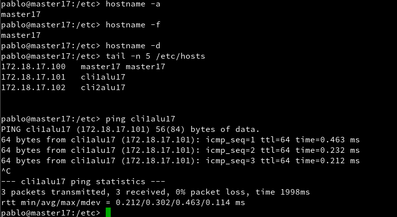
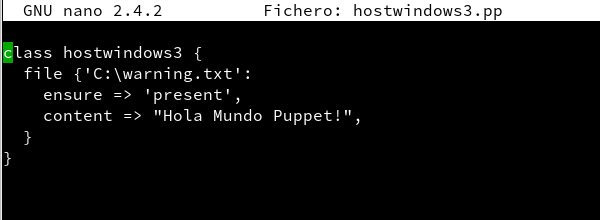
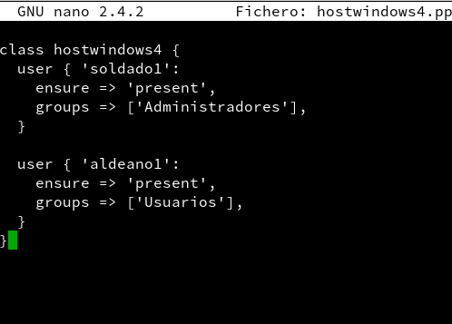

# PUPPET
## 1.-Preconfiguracion de la masquinas virtuales
* MV1 -master (el servidor)

* MV2 -cli1

* MV3 -cli3

### 1.1.-comprobar las configuraciones anteriores
* en MV1

* en MV2

* en MV3

## 2.-Instalacion y configuracion de los servidores
>Instalamos PUPPET

**Con lo siguiente que haremos sera para que se active automaticamente cuando se abra la maquina**

> Contenido de readme.txt

### 2.1 .-Site.pp
>site.pp es el fichero principal de configuración de órdenes para los agentes/nodos puppet.

### 2.2 .-hostlinux1.pp
**Crearemos la primera configuracion que llamaremos hostlinux1.pp**

**Miramos  quien es el propientario y en que grupo estan de los ficheros de PUPPET:**

> y reiniciamos puppet

**Comprobamos si hay algun error:**

**Desactivamos el cortafuegos para que no haya porblemas con el servicio:**

##3.-Instalacion y configuracion del cliente 1

**Instalamos el agente puppet:**

**El cliente puppet debe ser informado de quien será su master. Para ello, vamos a configurar /etc/puppet/puppet.conf:**

**Iniciamos puppet de nuevo**

## 4.-Certificados
>Debemos entrar como usuario root

**Consultamos las peticiones pendientes de unión al master:**

** Aceptamos al nuevo cliente desde el master y generamos un certificado:**

## 4.1 .-Comprobacion
>Nos aseguramos de que somos root

**Ejecutamos el siguiente comando para forzar la ejecución del agente puppet:**

**Comprobamos si hay errores**

## 5 .-Segunda versión del fichero pp
**Creamos un segundo fchero de configuracion que lamaremos hostlinux2.pp**

**Modificamos /etc/puppet/manifests/site.pp para que se use la configuración de hostlinux2 el lugar de la anterior:**

**por ultimo vamos al cliente usamos el comando pupper agent para iniciar la configuracion del master**

## 6.- Cliente Windows

**Creamos hostwindows3.pp y lo metemos en site.pp**

### 6.1.-Instalamos puppet en Windows

**Le decimos a puppet de windows quien es su master**

**Generamos el certificado**

**Abrimos la consola de puppet y ejecutamos con el agente puppet**

**Ponemos los siguientes comandos de configuracion**

>puppet agent -t --debug --verbose

>Facter

## 7.- Configuramos hostlinux4.pp

**Hacemos un nuevo fichero hostwindows4.pp y un hostwindows5 creado por nosotros**

**Y en el cliente windows lo ejecutamos**

