# Tareas programadas

## 1.Windows -Tarea diferida

En Windows 7 para abrir el programador de tareas vamos a Panel de control -> Herramientas administrativas -> Programador de tareas.

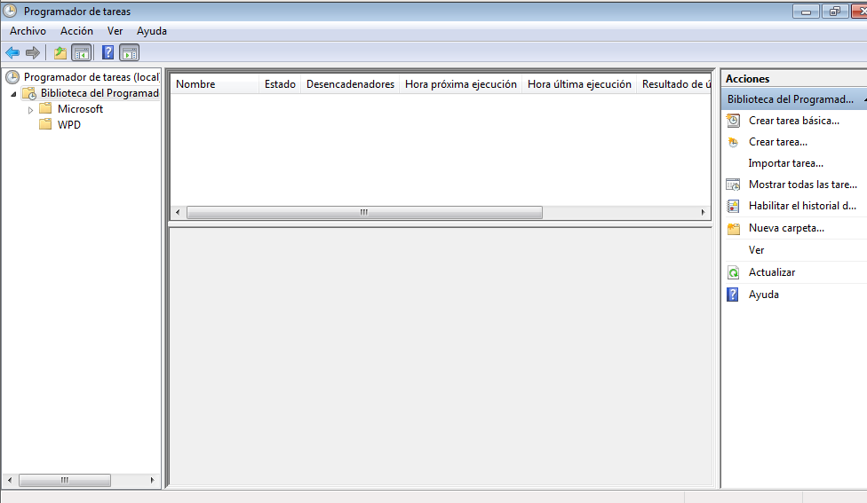

Ponemos un mensaje para que nos salga en pantalla

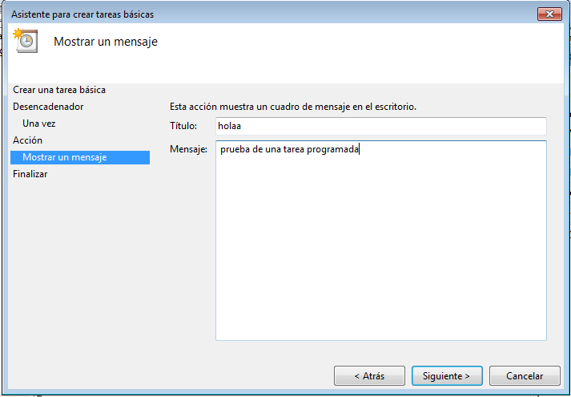

Y cuando llega a la hora se ejecutara nuestro script

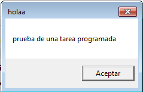

**Ahora hacemos otra tarea que nos inicie algun programa en nuestro caso el VNC**

Ponemos cuando queramos que nos inicie el programa

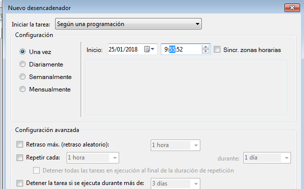

Ponemos la ruta del programa

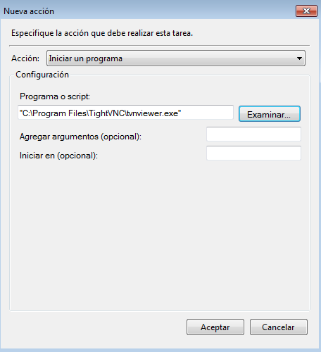

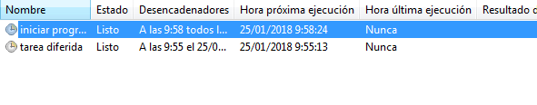

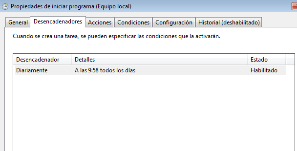

Y se nos inicia el programa cuando llega el momento

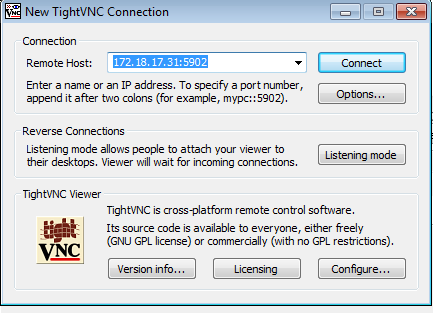

**Ahora creamos una tarea periodica para apagar el sistema**

primero hacemos un acceso directo al shutdown de Windows
>Creamos acceso directo ponemos
``SHUTDOWN /S /P``  y se hará

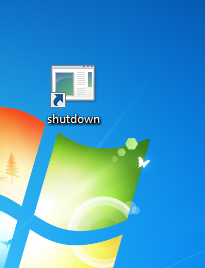

Ahora vamos a crear la tarea y ponemos la ruta del script

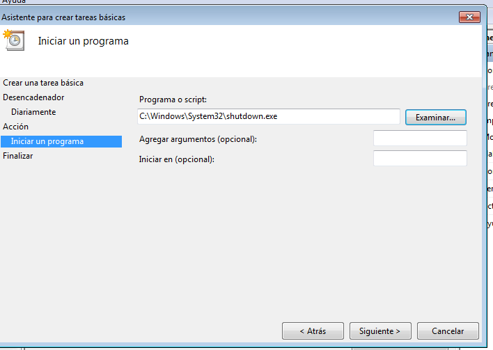

ponemos el temporizador

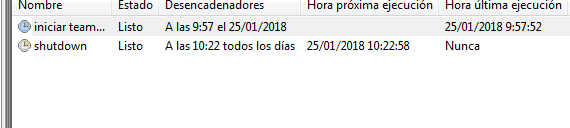

Y vemos que se ha ejecutado

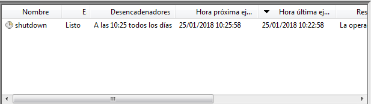

## 2.Gnu/Linux -Tarea diferida   

Creamos el script

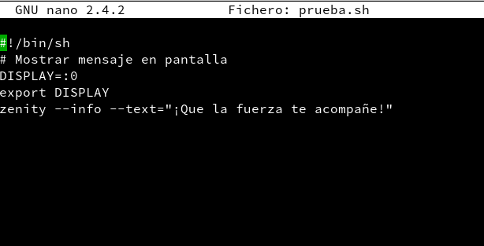

Ejecutamos el script y mientras miramos las tareas programadas con ``atq``

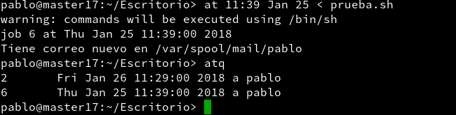

Se ejecita el script

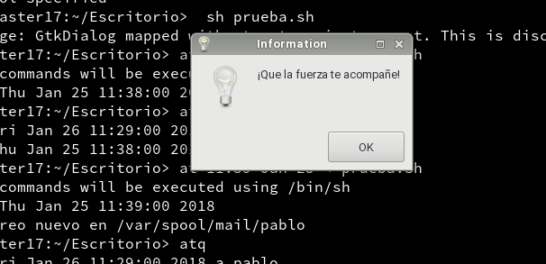

Y volvemos a usar ``atq`` para ver si hay tareas programadas

## 3.Gnu/Linux -Tarea periodica

Creamos un script con ``crontab -e``
>Hacemos una tarea periodica por ejemplo esta se ejecutara a los 14 minutos de la hora 12

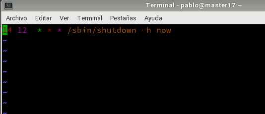

Ponemos el comando ``crontab -l`` para ver las tareas programadas y esperamos a que se ejecuten

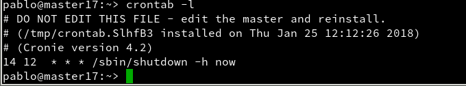
