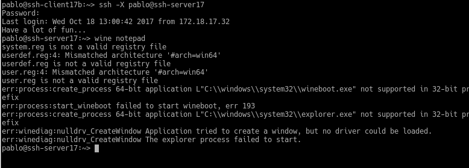

## Acceso remoto SSH

### Paso 1 :
  * #### Necesitamos:
     * Un servidor GNU/Linux OpenSUSE (IP 172.18.XX.31)
     * Un cliente GNU/Linux OpenSUSE (IP 172.18.XX.32)
     * Un cliente GNU/Linux OpenSUSE (IP 172.18.XX.32)  

* #### Preparativos:  
     * servidor open suse:    

           ya configurado metemos en la ruta /etc/host las ip del clientea y b   

           

   * ponemos unos comandos de comprobacion :  

     

     

   

   

  *  hacemos ping a las maquinas:  

        

   

  * Creamos los siguientes usuarios en el server:    

    

   * Añadimos las ip en etc/hosts  

* #### Cliente gnu/Linux  

       

* #### Cliente Windows  

    

    * Añadimos las ip en c:\Windows\System32\drivers\etc\hosts

     

* ### Paso 2 : Instalacion del servicio SSH  
   * Desde terminal zypper install openssh, instala el paquete OpenSSH.  

  
   * Comprobamos el funcionamiento del SSH con Systemctl status sshd y ps -ef|grep sshd para ver los procesos del sistema

  

  

  * Y netstat -ntap para mira que el puerto este escuchando  

    

* ### Paso 3   conexión SSH desde ssh-clientXXa  

   * Comprobamos la conectividad con el servidor desde el cliente con ping ssh-serverXX.  

   y Desde el cliente comprobamos que el servicio SSH es visible con nmap -Pn ssh-serverXX. Debe mostrarnos que el puerto 22 está abierto. Esto es, debe aparecer una línea como "22/tcp open ssh

      

  *   comprobar el funcionamiento de la conexión SSH desde cada cliente usando el usuario  viera 1  

   Desde el ssh-client1 nos conectamos mediante ssh 1er-apellido-alumno11@ssh-server  

        

  *  Comprobar contenido del fichero $HOME/.ssh/known_hosts en el equipo ssh-client1 ,para las claves ssh

    

* ### Paso 4 cambiamos las claves SSH del servidor  

  * Confirmamos que existen los siguientes ficheros en /etc/ssh, Los ficheros ssh_host*key y ssh_host*key.pub, son los ficheros de las claves publicas y privadas  

     

     

  * ahora modificamos el fichero de configuración SSH (/etc/ssh/sshd_config) para dejar una única línea: HostKey /etc/ssh/ssh_host_rsa_key   

       

* #### Ahora regeneramos certificados  

   * En ssh-server, como usuario root ejecutamos: ssh-keygen -t rsa -f /etc/ssh/ssh_host_rsa_key.

  

   * Reiniciar el servicio SSH: systemctl restart sshd

     

   * Comprobar que el servicio está en ejecución correctamente: systemctl status sshd  

  

* #### Comprobamos   
   * Comprobar qué sucede al volver a conectarnos desde los dos clientes, usando los usuarios 1er-apellido-alumno2 y 1er-apellido-alumno1.  

  

  * y ahora en el cliente windows usando el PUtty  

  

  

* ### Paso 4 : Personalización del prompt Bash    

  * añadimos las siguientes líneas al fichero de configuración del usuario1 en la máquina servidor (Fichero /home/1er-apellido-alumno1/.bashrc)  

     

  * Además, crear el fichero el fichero /home/1er-apellido-alumno1/.alias, donde pondremos el siguiente contenido  

   

* ### Paso 5 :Autentificacion mediante claves publicas  

       El objetivo de este apartado es el de configurar SSH para poder acceder desde el cliente1, usando el 1er-apellido-alumno4 sin poner password, pero usando claves pública/privada  

 * Iniciamos sesión con nuestro usuario nombre-alumno de la máquina ssh-client17a.    
 * Ejecutamos ssh-keygen -t rsa para generar un nuevo par de claves para el usuario en /home/nuestro-usuario/.ssh/id_rsa y /home/nuestro-usuario/.ssh/id_rsa.pub.  

   

 *  Ahora vamos a copiar la clave pública (id_rsa.pub) del usuario (nombre-de-alumno) de la máquina cliente, al fichero "authorized_keys" del usuario remoto 1er-apellido-alumno4

    

 * Comprobar que ahora al acceder remotamente vía SSH:  

 en open suse no pide :  

  

 en Windows si pide:  

    

* ### Paso 6 : Uso ssh como tunel para X

    * Instalamos en el servidor una aplicación de entorno gráfico (APP1) que no esté en los clientes.  

     

  * Miramos si esta instalada en el cliente :  

   

  * Modificamos servidor SSH para permitir la ejecución de aplicaciones gráficas, desde los clientes. Consultar fichero de configuración /etc/ssh/sshd_config (Opción X11Forwarding yes)  

     

* Con el comando ssh -X remoteuser1@ssh-server, podemos conectarnos de forma remota al servidor, y ahora ejecutamos APP1 de forma remota.  

  

* y vemos que funciona en el cliente    

    

* ### Paso 7 : Aplicaciones Windows nativas  

 * Instalamos emulador Wine en el ssh-server.   

   

  * Instalamos la aplicacion wine notepad  y Comprobar funcionamiento de APP2, accediendo desde ssh-client1  

     

      no funciona por problemas con la memoria de video   

* ### Paso 8 : Restricciones de uso   
* #### Restriccion sobre usuario  

  *  Consultar/modificar fichero de configuración del servidor SSH (/etc/ssh/sshd_config) para restringir el acceso a determinados usuarios. Consultar las opciones AllowUsers, DenyUsers.

     

 * Y no deja acceder a este fichero el usuarios viera3

   

* #### Restriccion sobre una aplicacion  

 * metemos a viera3 en el grupo remoteapps   

    

   * Poner al programa APP1 el grupo propietario a remoteapps.  

  

  * Poner los permisos del ejecutable de APP1 a 750. Para impedir que los usurios que no pertenezcan al grupo puedan ejecutar el programa.

   

* Comprobamos el funcionamiento en el servidor.

  

* Comprobamos el funcionamiento desde el cliente.
 
      
